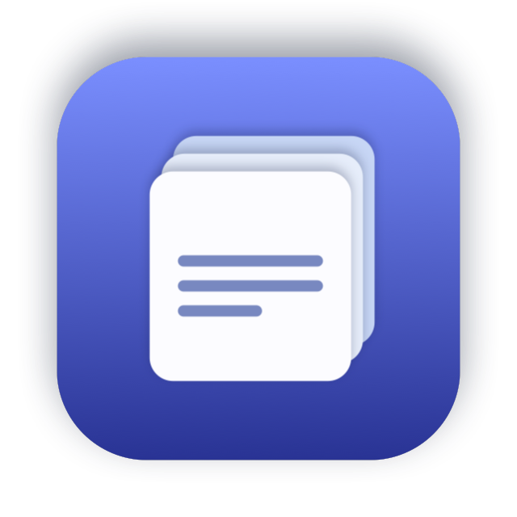
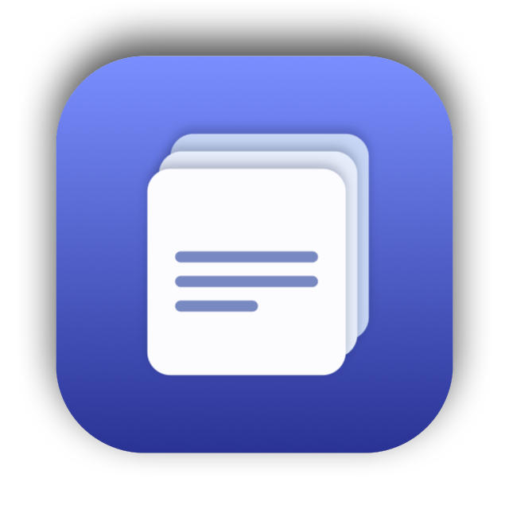

  
  

# Clip

A macOS menu bar app that keeps clipboard history on this Mac.

Hold **⌘V** to open history next to the pointer. A quick **⌘V** still pastes. History stays in Application Support.

Requires **macOS 15** or later.

## Features

- Search, pin, and paste clips. **⌘1–⌘9** paste a row. **↩** pastes the selection. **⌘⌫** deletes it.
- Optional menu bar icon and launch at login.
- Optional extra keyboard shortcut.

## Permissions

Accessibility is required to paste into other apps and to tell a tap of **⌘V** from a hold. macOS grants it per app copy. Enable the entry that matches the build you are running, then relaunch.

## Build

Open `Clip.xcodeproj` in Xcode 16 or later.

## License

[MIT](LICENSE)
